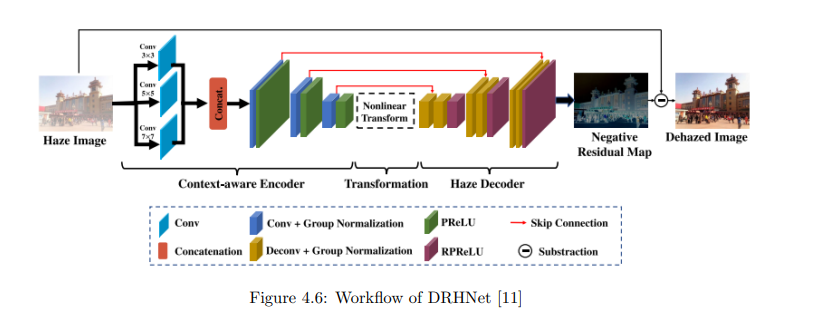
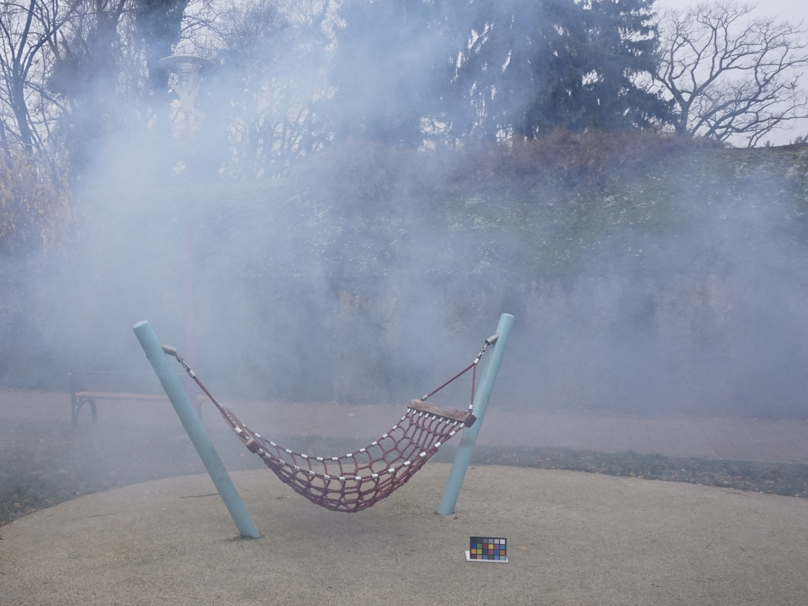
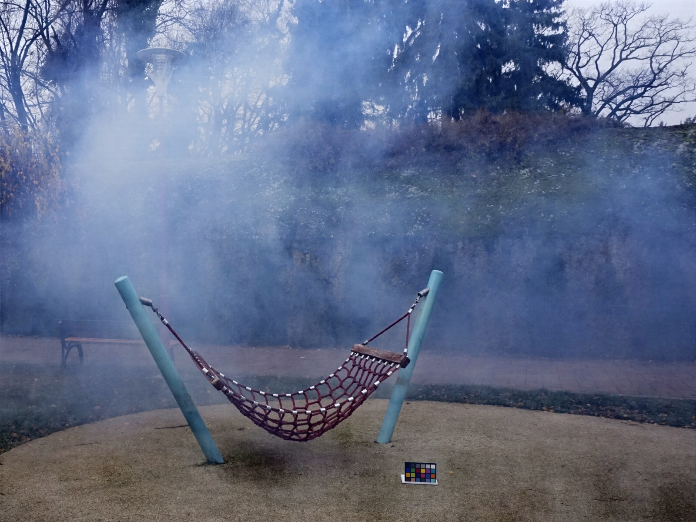

### Requirements
  *tensorflow-gpu 1.8.0
  *python-opencv 3.4.2
  *numpy

### Test
  *python test.py --task [dehaze_outdoor| dehaze_indoor | derain] --indir [the path of the input image] --showShortcut [True | False]

###Demo Run
  *python test.py --task dehaze_outdoor --indir samples/1.jpg --showShortcut True

  Here is the work-flow:
<figure class="half">
    
</figure>

Input Hazy image and Output Dehazed image:
<figure class="half">
    
    
</figure>
